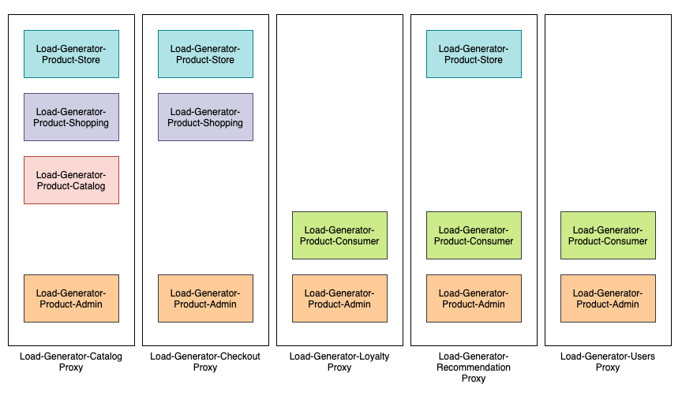
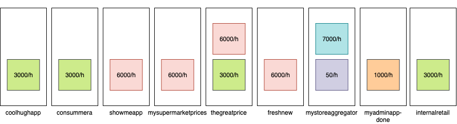

# Load generation for apigee demo.

This project aims to showcase Apigee monitoring features by generating distributed traffic across 5 proxies:

- Load-Generator-Users
- Load-Generator-Recommendation
- Load-Generator-Loyalty
- Load-Generator-Checkout
- Load-Generator-Catalog

This traffic ensure that there is constant hit on cache, errors and different apps built on top of API Products.

All assets in this project start with Load-Generator.

**Demo Product/Proxies relationship**



**Demo Product/Apps relationship with quotas**


**API Monitoring**
- Traffic success vs. Errors (all proxies)
- Average response time (enter low rate high peaks) - Introduce latency.
- Traffic by proxy - 5 proxies, different traffic.
- Cache performance - 1 proxy with cache
- 4xx vs, 5xx errors - Introduce client errors vs. backend errors.
- Errors by proxy.
- Target performance - payload size (random)

**API Analytics**
- Device types
- OS
- Agent type
- Browser
- Geo location of API caller
- Latency
- App, API product and developer
- API paths

### How to:

1) Tracing and errors in real time
- Load-Generator-Catalog
2) Cache performance
- Load-Generator-Catalog
3) Quota errors
- *Load-Generator-Catalog* with app *mystoreaggregator*
4) Developer Engagement
5) Agent type

## Installation:
- Note: You need to have gcloud-sdk installed, maven plugins, and docker.
- Note 2: You need to own a domain name to use as backend DNS domain names.

```bash
sh initial.sh <APIGEE_USER> <APIGEE_PASS> <APIGEE_ORG> <APIGEE_ENV> <GPROJECT> <APPENGINE> <APIGEE_URL>  <APPENGINE_DOMAIN_NAME> <UUID>
```

*UUID* is a random number to be consistent when deleting.

to delete:

```bash
sh delete-all.sh <APIGEE_USER> <APIGEE_PASS> <APIGEE_ORG> <APIGEE_ENV> <UUID>
```

## TODO:

- Delete appengine app - so far, promoting it.
- Use Locust Distributed
- tag all resources and delete without hardcoding (delete-all.sh)
- tweak product quotas (only mystoreaggregator gives quota errors)
- Change error messages and http codes.
- add oauth to cache tokens and showcase specific cache metrics
- Custom reports